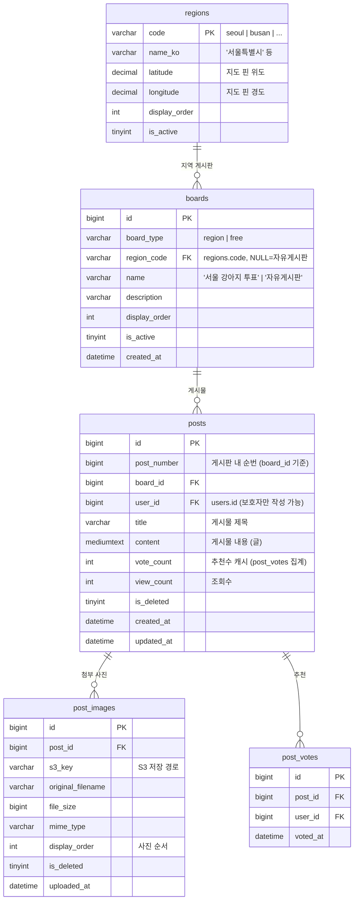

# 강아지 투표 게시판 DB 설계

> 각 시/도별 강아지 투표 게시판 + 자유게시판  
> MySQL 8.0+ InnoDB 기준 v1.0

---

## 테이블 목록

| # | 테이블명 | 설명 |
|---|----------|------|
| 1 | `regions` | 시/도 지역 코드 마스터 |
| 2 | `boards` | 게시판 목록 (지역별 + 자유) |
| 3 | `posts` | 게시물 |
| 4 | `post_images` | 게시물 첨부 사진 (S3) |
| 5 | `post_votes` | 게시물 추천/투표 (중복 방지) |

> **기존 테이블 수정**  
> `guardians` 테이블에 `region_code VARCHAR(20)` 컬럼 추가 필요.  
> `guardian.address` 는 AES-256 암호화라 지역 판별 불가 → 별도 평문 컬럼으로 분리.

---

## ERD (Mermaid)



---

## DDL 상세

### 기존 테이블 수정: guardians — region_code 추가

```sql
-- 보호자 지역 코드 추가 (지역 투표 제한용, 평문 저장)
ALTER TABLE guardians
    ADD COLUMN region_code VARCHAR(20) NULL
        COMMENT '시/도 코드 (regions.code 참조, 앱 레벨 FK)',
    ADD INDEX idx_guardians_region (region_code);
```

> **설계 의도**: `address` 는 암호화 저장이라 지역 판별 불가.  
> `region_code` 는 "어느 시/도 게시판에서 투표할 수 있는지"만 저장하는 별도 평문 컬럼.  
> DB FK는 걸지 않고 앱 레벨에서 `regions.code` 유효성 검사.

---

### 1. regions — 시/도 지역 마스터

```sql
CREATE TABLE regions (
    code          VARCHAR(20)    PRIMARY KEY,
    name_ko       VARCHAR(50)    NOT NULL,
    latitude      DECIMAL(10,7)  NOT NULL COMMENT '지도 핀 위도',
    longitude     DECIMAL(10,7)  NOT NULL COMMENT '지도 핀 경도',
    display_order INT            NOT NULL DEFAULT 0,
    is_active     TINYINT(1)     NOT NULL DEFAULT 1
) ENGINE=InnoDB DEFAULT CHARSET=utf8mb4 COLLATE=utf8mb4_unicode_ci;

-- 17개 시/도 초기 데이터
INSERT INTO regions (code, name_ko, latitude, longitude, display_order) VALUES
('seoul',    '서울특별시',       37.5665000, 126.9780000, 1),
('busan',    '부산광역시',       35.1796000, 129.0756000, 2),
('daegu',    '대구광역시',       35.8714000, 128.6014000, 3),
('incheon',  '인천광역시',       37.4563000, 126.7052000, 4),
('gwangju',  '광주광역시',       35.1595000, 126.8526000, 5),
('daejeon',  '대전광역시',       36.3504000, 127.3845000, 6),
('ulsan',    '울산광역시',       35.5384000, 129.3114000, 7),
('sejong',   '세종특별자치시',   36.4800000, 127.2890000, 8),
('gyeonggi', '경기도',           37.4138000, 127.5183000, 9),
('gangwon',  '강원특별자치도',   37.8228000, 128.1555000, 10),
('chungbuk', '충청북도',         36.8000000, 127.7000000, 11),
('chungnam', '충청남도',         36.5184000, 126.8000000, 12),
('jeonbuk',  '전북특별자치도',   35.7175000, 127.1530000, 13),
('jeonnam',  '전라남도',         34.8679000, 126.9910000, 14),
('gyeongbuk','경상북도',         36.4919000, 128.8889000, 15),
('gyeongnam','경상남도',         35.4606000, 128.2132000, 16),
('jeju',     '제주특별자치도',   33.4996000, 126.5312000, 17);
```

---

### 2. boards — 게시판

```sql
CREATE TABLE boards (
    id            BIGINT AUTO_INCREMENT PRIMARY KEY,
    board_type    VARCHAR(20)  NOT NULL
                  CHECK (board_type IN ('region', 'free')),
    region_code   VARCHAR(20)  NULL,       -- region 타입만 값 있음, free는 NULL
    name          VARCHAR(100) NOT NULL,
    description   VARCHAR(255),
    display_order INT          NOT NULL DEFAULT 0,
    is_active     TINYINT(1)   NOT NULL DEFAULT 1,
    created_at    DATETIME     NOT NULL DEFAULT CURRENT_TIMESTAMP,
    UNIQUE (board_type, region_code)       -- 지역당 게시판 하나만
) ENGINE=InnoDB DEFAULT CHARSET=utf8mb4 COLLATE=utf8mb4_unicode_ci;
ALTER TABLE boards ADD CONSTRAINT fk_boards_region FOREIGN KEY (region_code) REFERENCES regions(code);

-- 17개 지역 게시판 + 자유게시판 초기 데이터
INSERT INTO boards (board_type, region_code, name, description, display_order) VALUES
('region', 'seoul',    '서울 강아지 투표', '서울 지역 반려견 사진을 올리고 투표하세요!', 1),
('region', 'busan',    '부산 강아지 투표', '부산 지역 반려견 사진을 올리고 투표하세요!', 2),
('region', 'daegu',    '대구 강아지 투표', '대구 지역 반려견 사진을 올리고 투표하세요!', 3),
('region', 'incheon',  '인천 강아지 투표', '인천 지역 반려견 사진을 올리고 투표하세요!', 4),
('region', 'gwangju',  '광주 강아지 투표', '광주 지역 반려견 사진을 올리고 투표하세요!', 5),
('region', 'daejeon',  '대전 강아지 투표', '대전 지역 반려견 사진을 올리고 투표하세요!', 6),
('region', 'ulsan',    '울산 강아지 투표', '울산 지역 반려견 사진을 올리고 투표하세요!', 7),
('region', 'sejong',   '세종 강아지 투표', '세종 지역 반려견 사진을 올리고 투표하세요!', 8),
('region', 'gyeonggi', '경기 강아지 투표', '경기 지역 반려견 사진을 올리고 투표하세요!', 9),
('region', 'gangwon',  '강원 강아지 투표', '강원 지역 반려견 사진을 올리고 투표하세요!', 10),
('region', 'chungbuk', '충북 강아지 투표', '충북 지역 반려견 사진을 올리고 투표하세요!', 11),
('region', 'chungnam', '충남 강아지 투표', '충남 지역 반려견 사진을 올리고 투표하세요!', 12),
('region', 'jeonbuk',  '전북 강아지 투표', '전북 지역 반려견 사진을 올리고 투표하세요!', 13),
('region', 'jeonnam',  '전남 강아지 투표', '전남 지역 반려견 사진을 올리고 투표하세요!', 14),
('region', 'gyeongbuk','경북 강아지 투표', '경북 지역 반려견 사진을 올리고 투표하세요!', 15),
('region', 'gyeongnam','경남 강아지 투표', '경남 지역 반려견 사진을 올리고 투표하세요!', 16),
('region', 'jeju',     '제주 강아지 투표', '제주 지역 반려견 사진을 올리고 투표하세요!', 17),
('free',    NULL,      '자유게시판',        '자유롭게 반려동물 이야기를 나눠요!',          18);
```

---

### 3. posts — 게시물

```sql
CREATE TABLE posts (
    id          BIGINT AUTO_INCREMENT PRIMARY KEY,
    post_number BIGINT       NOT NULL,    -- 게시판 내 순번 (앱 레벨에서 채번)
    board_id    BIGINT       NOT NULL,
    user_id     BIGINT       NOT NULL,    -- guardians 의 user_id
    title       VARCHAR(200) NOT NULL,
    content     MEDIUMTEXT,
    vote_count  INT          NOT NULL DEFAULT 0,   -- 추천수 캐시
    view_count  INT          NOT NULL DEFAULT 0,
    is_deleted  TINYINT(1)   NOT NULL DEFAULT 0,
    created_at  DATETIME     NOT NULL DEFAULT CURRENT_TIMESTAMP,
    updated_at  DATETIME     NOT NULL DEFAULT CURRENT_TIMESTAMP ON UPDATE CURRENT_TIMESTAMP,
    UNIQUE (board_id, post_number)
) ENGINE=InnoDB DEFAULT CHARSET=utf8mb4 COLLATE=utf8mb4_unicode_ci;
ALTER TABLE posts ADD CONSTRAINT fk_posts_board FOREIGN KEY (board_id) REFERENCES boards(id);
ALTER TABLE posts ADD CONSTRAINT fk_posts_user  FOREIGN KEY (user_id)  REFERENCES users(id);

CREATE INDEX idx_posts_board_votes   ON posts(board_id, vote_count DESC, id DESC);  -- 지역 랭킹 조회
CREATE INDEX idx_posts_board_created ON posts(board_id, created_at DESC);           -- 최신순 조회
CREATE INDEX idx_posts_user          ON posts(user_id);
```

> **post_number 채번 방식**: INSERT 시 `SELECT COALESCE(MAX(post_number), 0) + 1 FROM posts WHERE board_id = ?`  
> 동시성 문제 방지를 위해 서비스 레이어에서 트랜잭션 + 비관적 잠금 or 앱 레벨 시퀀스 사용 권장.

---

### 4. post_images — 첨부 사진 (S3 패턴)

```sql
CREATE TABLE post_images (
    id                BIGINT AUTO_INCREMENT PRIMARY KEY,
    post_id           BIGINT       NOT NULL,
    s3_key            VARCHAR(500) NOT NULL,
    original_filename VARCHAR(255),
    file_size         BIGINT,
    mime_type         VARCHAR(100),
    display_order     INT          NOT NULL DEFAULT 0,  -- 사진 순서
    is_deleted        TINYINT(1)   NOT NULL DEFAULT 0,
    uploaded_at       DATETIME     NOT NULL DEFAULT CURRENT_TIMESTAMP
) ENGINE=InnoDB DEFAULT CHARSET=utf8mb4 COLLATE=utf8mb4_unicode_ci;
ALTER TABLE post_images ADD CONSTRAINT fk_pimg_post FOREIGN KEY (post_id) REFERENCES posts(id) ON DELETE CASCADE;

CREATE INDEX idx_pimg_post_id ON post_images(post_id, display_order);
```

---

### 5. post_votes — 추천/투표

```sql
CREATE TABLE post_votes (
    id       BIGINT AUTO_INCREMENT PRIMARY KEY,
    post_id  BIGINT   NOT NULL,
    user_id  BIGINT   NOT NULL,
    voted_at DATETIME NOT NULL DEFAULT CURRENT_TIMESTAMP,
    UNIQUE (post_id, user_id)   -- 1인 1추천
) ENGINE=InnoDB DEFAULT CHARSET=utf8mb4 COLLATE=utf8mb4_unicode_ci;
ALTER TABLE post_votes ADD CONSTRAINT fk_pv_post FOREIGN KEY (post_id) REFERENCES posts(id) ON DELETE CASCADE;
ALTER TABLE post_votes ADD CONSTRAINT fk_pv_user FOREIGN KEY (user_id) REFERENCES users(id);

CREATE INDEX idx_pv_user_id ON post_votes(user_id);
```

---

## 주요 쿼리

### 지역별 랭킹 TOP 10 (지도 핀용)

```sql
SELECT
    p.id,
    p.post_number,
    p.title,
    p.vote_count,
    r.code          AS region_code,
    r.name_ko       AS region_name,
    r.latitude,
    r.longitude,
    pi.s3_key       AS thumbnail_s3_key,   -- 대표 사진 (display_order=0)
    RANK() OVER (PARTITION BY b.region_code ORDER BY p.vote_count DESC, p.created_at DESC) AS `rank`
FROM posts p
JOIN boards b  ON b.id = p.board_id
JOIN regions r ON r.code = b.region_code
LEFT JOIN post_images pi ON pi.post_id = p.id AND pi.display_order = 0 AND pi.is_deleted = 0
WHERE b.board_type = 'region'
  AND p.is_deleted = 0
HAVING `rank` <= 10
ORDER BY r.display_order, `rank`;
```

### 게시판 목록 조회 (탭 목록)

```sql
SELECT b.id, b.board_type, b.region_code, b.name, b.display_order,
       r.latitude, r.longitude
FROM boards b
LEFT JOIN regions r ON r.code = b.region_code
WHERE b.is_active = 1
ORDER BY b.display_order;
```

### 투표 가능 여부 확인 (지역 제한)

```sql
-- 보호자의 region_code와 게시판의 region_code 비교
SELECT g.region_code, b.region_code AS board_region,
       (g.region_code = b.region_code OR b.board_type = 'free') AS can_vote
FROM guardians g, boards b
WHERE g.user_id = :userId AND b.id = :boardId;
```

---

## 설계 원칙

| 항목 | 결정 |
|------|------|
| 지역 투표 제한 | 앱 레벨에서 `guardian.region_code` vs `board.region_code` 비교 |
| 자유게시판 투표 | 제한 없음 (`board_type = 'free'` 이면 누구나 추천 가능) |
| 중복 투표 방지 | `post_votes(post_id, user_id)` UNIQUE 제약으로 DB 레벨 차단 |
| 추천수 캐시 | `posts.vote_count` 에 비정규화 캐시, 실제 원본은 `post_votes` 카운트 |
| 사진 저장 | S3 직접 업로드 후 s3_key만 DB 저장 (PetChain 기존 패턴과 동일) |
| 게시물 번호 | 게시판별 순번 (`UNIQUE(board_id, post_number)`) |
| 지도 핀 위치 | `regions.latitude / longitude` 고정값 (시/도 중심 좌표) |
| 랭킹 기준 | `vote_count DESC`, 동점 시 `created_at DESC` (먼저 올린 글 우선) |
