# PetChain 데이터베이스 설계 (ERD)

> 블록체인 기반 펫보험 진료기록 검증 인프라  
> 오프체인 DB (MySQL 8.0+ / InnoDB 기준) 스키마 설계서 v1.5

---

## 전체 테이블 목록

| # | 테이블명 | 설명 |
|---|----------|------|
| 1 | `users` | 회원 계정 (로그인 정보) |
| 2 | `refresh_tokens` | JWT 리프레시 토큰 |
| 3 | `guardians` | 보호자 프로필 |
| 4 | `hospitals` | 동물병원 프로필 |
| 5 | `insurance_companies` | 보험사 프로필 |
| 6 | `pets` | 반려동물 정보 |
| 7 | `pet_insurance` | 보호자-보험 가입 정보 |
| 8 | `disease_codes` | 표준 질병코드 마스터 |
| 9 | `treatment_codes` | 표준 진료행위코드 마스터 |
| 10 | `medical_records` | 진료기록 (오프체인) |
| 11 | `medical_record_diseases` | 진료기록-질병코드 중간 테이블 (다:다) |
| 12 | `medical_record_treatments` | 진료기록-진료행위 중간 테이블 (다:다) |
| 13 | `medical_record_files` | 진료기록 첨부파일 (S3) |
| 14 | `claim_packages` | 보험 청구 패키지 |
| 15 | `consent_history` | 보호자 동의 이력 |
| 16 | `verification_logs` | 보험사 검증 API 호출 이력 |
| 17 | `nft_tokens` | 검증완료 NFT 토큰 정보 |
| 18 | `point_balances` | 포인트/크레딧 잔액 |
| 19 | `point_transactions` | 포인트/크레딧 거래 이력 |
| 20 | `audit_logs` | 시스템 감사 로그 |

---

## ERD (Mermaid)

```mermaid
erDiagram

    users {
        bigint      id              PK
        varchar     login_id        UK  "로그인 아이디"
        varchar     password_hash       "bcrypt 해시"
        varchar     member_type         "user | hospital | insurance | platform"
        varchar     status              "active | suspended | withdrawn"
        datetime    last_login_at
        datetime    created_at
        datetime    updated_at
    }

    refresh_tokens {
        bigint      id              PK
        bigint      user_id         FK
        varchar     token_hash      UK  "SHA-256 해시 (원문 저장 금지)"
        varchar     device_info
        datetime    expires_at
        tinyint     is_revoked
        datetime    created_at
    }

    guardians {
        bigint      id              PK
        bigint      user_id         FK
        varchar     member_number   UK  "GRD-YYYYNNNNN"
        varchar     name                "AES-256 암호화"
        varchar     phone               "AES-256 암호화"
        varchar     email
        varchar     address             "AES-256 암호화"
        varchar     identity_verified   "none | pending | verified"
        datetime    created_at
        datetime    updated_at
    }

    hospitals {
        bigint      id              PK
        bigint      user_id         FK
        varchar     member_number   UK  "HSP-YYYYNNNNN"
        varchar     name
        varchar     business_number
        varchar     address
        varchar     phone
        varchar     fabric_org_id       "HospitalA Org ID"
        varchar     admin_email
        tinyint     is_active           "0=승인대기 1=활성"
        datetime    created_at
        datetime    updated_at
    }

    insurance_companies {
        bigint      id              PK
        bigint      user_id         FK
        varchar     member_number   UK  "INS-YYYYNNNNN"
        varchar     name
        varchar     business_number
        varchar     fabric_org_id       "InsuranceA Org ID"
        varchar     admin_email
        datetime    created_at
        datetime    updated_at
    }

    pets {
        bigint      id              PK
        bigint      guardian_id     FK
        varchar     pet_number      UK  "PET-YYYYNNNNN"
        varchar     name
        varchar     species             "dog | cat | rabbit | other"
        varchar     breed
        int         birth_year
        varchar     gender              "male | female | unknown"
        varchar     microchip_hash  UK  "SHA-256 해시 (원문 저장 금지)"
        varchar     sbt_token_id    UK  "온체인 SBT ID"
        varchar     sbt_status          "pending | issued"
        tinyint     is_neutered
        datetime    registered_at
        datetime    updated_at
    }

    pet_insurance {
        bigint      id                      PK
        bigint      pet_id                  FK
        bigint      guardian_id             FK  "조회 편의용 역정규화"
        bigint      insurance_company_id    FK
        varchar     policy_number               "AES-256 암호화"
        varchar     product_name
        date        start_date
        date        end_date
        varchar     status                      "active | expired | cancelled"
        datetime    created_at
        datetime    updated_at
    }

    disease_codes {
        varchar     code            PK  "KC-001 등"
        varchar     name_ko
        varchar     name_en
        varchar     category
        tinyint     is_active
    }

    treatment_codes {
        varchar     code            PK  "VA-011 등"
        varchar     name_ko
        varchar     name_en
        varchar     category
        tinyint     is_active
    }

    medical_records {
        bigint      id              PK
        varchar     record_id       UK  "REC-YYYY-NNNNN"
        bigint      hospital_id     FK
        bigint      pet_id          FK
        int         total_cost          "진료비 총액 (온체인)"
        date        treatment_date
        varchar     detail_data_hash    "SHA-256 해시 (온체인)"
        text        findings_encrypted  "AES-256 암호화"
        text        prescription_encrypted "AES-256 암호화"
        text        test_results_encrypted "AES-256 암호화"
        varchar     fabric_tx_id
        varchar     on_chain_status     "pending | confirmed | failed"
        datetime    created_at
        datetime    updated_at
    }

    medical_record_diseases {
        bigint      id                  PK
        bigint      medical_record_id   FK
        varchar     disease_code        FK  "disease_codes.code"
        boolean     is_primary              "주진단 여부"
    }

    medical_record_treatments {
        bigint      id                  PK
        bigint      medical_record_id   FK
        varchar     treatment_code      FK  "treatment_codes.code"
        int         unit_cost               "해당 행위 단가"
    }

    medical_record_files {
        bigint      id                  PK
        bigint      medical_record_id   FK
        varchar     file_type               "xray | ultrasound | receipt | other"
        varchar     s3_key
        varchar     original_filename
        bigint      file_size
        varchar     mime_type
        tinyint     is_deleted
        datetime    uploaded_at
    }

    claim_packages {
        bigint      id                      PK
        varchar     claim_id                UK  "CLM-YYYY-NNNNN"
        bigint      medical_record_id       FK
        bigint      pet_insurance_id        FK
        bigint      insurance_company_id    FK
        bigint      guardian_id             FK  "조회 편의용 역정규화"
        varchar     consent_status              "pending | active | revoked"
        varchar     claim_status                "pending | requested | verified | approved | rejected"
        varchar     fabric_tx_id
        varchar     verify_tx_id
        varchar     review_result               "approved | rejected"
        text        review_note
        datetime    consented_at
        datetime    verified_at
        datetime    reviewed_at
        datetime    created_at
        datetime    updated_at
    }

    consent_history {
        bigint      id                  PK
        bigint      claim_package_id    FK
        bigint      guardian_id         FK
        varchar     action                  "consent | revoke"
        varchar     previous_status
        varchar     new_status
        varchar     ip_address
        varchar     fabric_tx_id
        datetime    acted_at
    }

    verification_logs {
        bigint      id                      PK
        bigint      claim_package_id        FK
        bigint      insurance_company_id    FK
        varchar     result                      "verified | hash_mismatch | duplicate | consent_revoked | error"
        int         points_spent
        varchar     fabric_tx_id
        varchar     requested_by
        datetime    requested_at
    }

    nft_tokens {
        bigint      id                  PK
        varchar     token_id            UK  "NFT-CLAIM-xxxxx"
        bigint      claim_package_id    FK
        varchar     record_id               "medical_records.record_id"
        varchar     claim_id                "claim_packages.claim_id"
        varchar     detail_hash             "진료기록 해시 (원문 미포함)"
        varchar     issued_by               "PlatformOrg | HospitalOrg"
        varchar     fabric_tx_id
        datetime    issued_at
    }

    point_balances {
        bigint      id          PK
        varchar     owner_type      "hospital | insurance"
        bigint      owner_id        "폴리모픽: FK 없음, 앱 레벨 보장"
        int         balance
        datetime    updated_at
    }

    point_transactions {
        bigint      id                  PK
        varchar     tx_type                 "issue | spend | reward | burn | transfer"
        varchar     from_owner_type         "platform | hospital | insurance"
        bigint      from_owner_id
        varchar     to_owner_type
        bigint      to_owner_id
        int         amount
        varchar     description
        bigint      related_claim_id    FK  "nullable"
        varchar     fabric_tx_id
        datetime    created_at
    }

    audit_logs {
        bigint      id          PK
        bigint      user_id     FK  "nullable"
        varchar     action
        varchar     target_type
        bigint      target_id
        varchar     ip_address
        json       before_data
        json       after_data
        varchar     fabric_tx_id
        datetime    created_at
    }

    users ||--o{ refresh_tokens          : "토큰 보유"
    users ||--o| guardians               : "1:1"
    users ||--o| hospitals               : "1:1"
    users ||--o| insurance_companies     : "1:1"

    guardians ||--o{ pets                : "보유"
    guardians ||--o{ pet_insurance       : "편의 FK"
    pets ||--o{ pet_insurance            : "가입"
    insurance_companies ||--o{ pet_insurance : "제공"

    hospitals ||--o{ medical_records     : "등록"
    pets ||--o{ medical_records          : "진료 대상"

    medical_records ||--o{ medical_record_diseases   : "질병코드 목록"
    medical_records ||--o{ medical_record_treatments : "행위코드 목록"
    medical_records ||--o{ medical_record_files      : "첨부파일"
    medical_records ||--o{ claim_packages            : "청구 생성"

    disease_codes ||--o{ medical_record_diseases     : "코드 참조"
    treatment_codes ||--o{ medical_record_treatments : "코드 참조"

    pet_insurance ||--o{ claim_packages          : "청구 연결"
    insurance_companies ||--o{ claim_packages    : "청구 대상"
    guardians ||--o{ claim_packages              : "편의 FK"

    claim_packages ||--o{ consent_history        : "동의 이력"
    claim_packages ||--o{ verification_logs      : "검증 이력"
    claim_packages ||--o| nft_tokens             : "NFT 발급"
    claim_packages ||--o{ point_transactions     : "포인트 연동"

    guardians ||--o{ consent_history             : "동의 주체"
    insurance_companies ||--o{ verification_logs : "검증 수행"
    users ||--o{ audit_logs                      : "행위 주체"
```



---

## 테이블 상세 명세 (DDL)

### 공통: updated_at 자동 갱신

MySQL은 `DATETIME` 컬럼에 `ON UPDATE CURRENT_TIMESTAMP`를 지원합니다.  
모든 `updated_at` 컬럼을 아래 패턴으로 선언하면 별도 트리거 없이 자동 갱신됩니다.

```sql
-- 각 테이블의 updated_at 컬럼 선언 패턴
updated_at DATETIME NOT NULL DEFAULT CURRENT_TIMESTAMP ON UPDATE CURRENT_TIMESTAMP
```

> PostgreSQL의 트리거 방식 불필요 — MySQL이 네이티브로 처리합니다.

---

### 1. users — 회원 계정

```sql
CREATE TABLE users (
    id              BIGINT AUTO_INCREMENT PRIMARY KEY,
    login_id        VARCHAR(100) NOT NULL UNIQUE,
    password_hash   VARCHAR(255) NOT NULL,
    member_type     VARCHAR(20)  NOT NULL
                    CHECK (member_type IN ('user','hospital','insurance','platform')),
    status          VARCHAR(20)  NOT NULL DEFAULT 'active'
                    CHECK (status IN ('active','suspended','withdrawn')),
    last_login_at DATETIME,
    created_at DATETIME NOT NULL DEFAULT CURRENT_TIMESTAMP,
    updated_at DATETIME NOT NULL DEFAULT CURRENT_TIMESTAMP ON UPDATE CURRENT_TIMESTAMP
) ENGINE=InnoDB DEFAULT CHARSET=utf8mb4 COLLATE=utf8mb4_unicode_ci;

CREATE INDEX idx_users_login_id    ON users(login_id);
CREATE INDEX idx_users_member_type ON users(member_type);

```

---

### 2. refresh_tokens — JWT 리프레시 토큰

```sql
CREATE TABLE refresh_tokens (
    id          BIGINT AUTO_INCREMENT PRIMARY KEY,
    user_id     BIGINT       NOT NULL,
    token_hash  VARCHAR(64)  NOT NULL UNIQUE,  -- SHA-256 해시 (원문 저장 금지)
    device_info VARCHAR(255),
    expires_at DATETIME NOT NULL,
    is_revoked  TINYINT(1)   NOT NULL DEFAULT 0,
    created_at DATETIME NOT NULL DEFAULT CURRENT_TIMESTAMP
) ENGINE=InnoDB DEFAULT CHARSET=utf8mb4 COLLATE=utf8mb4_unicode_ci;
ALTER TABLE refresh_tokens ADD CONSTRAINT fk_rt_user FOREIGN KEY (user_id) REFERENCES users(id) ON DELETE CASCADE;

CREATE INDEX idx_rt_user_id    ON refresh_tokens(user_id);
CREATE INDEX idx_rt_expires_at ON refresh_tokens(expires_at);
```

---

### 3. guardians — 보호자 프로필

```sql
CREATE TABLE guardians (
    id                BIGINT AUTO_INCREMENT PRIMARY KEY,
    user_id           BIGINT       NOT NULL UNIQUE,
    member_number     VARCHAR(20)  NOT NULL UNIQUE,  -- GRD-YYYYNNNNN
    name              VARCHAR(255) NOT NULL,    -- AES-256 암호화
    phone             VARCHAR(255),             -- AES-256 암호화
    email             VARCHAR(255),
    address           MEDIUMTEXT,                     -- AES-256 암호화
    identity_verified VARCHAR(20)  NOT NULL DEFAULT 'none'
                      CHECK (identity_verified IN ('none','pending','verified')),
    created_at DATETIME NOT NULL DEFAULT CURRENT_TIMESTAMP,
    updated_at DATETIME NOT NULL DEFAULT CURRENT_TIMESTAMP ON UPDATE CURRENT_TIMESTAMP
) ENGINE=InnoDB DEFAULT CHARSET=utf8mb4 COLLATE=utf8mb4_unicode_ci;
ALTER TABLE guardians ADD CONSTRAINT fk_guardians_user FOREIGN KEY (user_id) REFERENCES users(id);

```

---

### 4. hospitals — 동물병원

```sql
-- 잔액은 point_balances 테이블에서 단일 관리 (credit_balance 컬럼 없음)
CREATE TABLE hospitals (
    id              BIGINT AUTO_INCREMENT PRIMARY KEY,
    user_id         BIGINT       NOT NULL UNIQUE,
    member_number   VARCHAR(20)  NOT NULL UNIQUE,  -- HSP-YYYYNNNNN
    name            VARCHAR(200) NOT NULL,
    business_number VARCHAR(20)  UNIQUE,
    address         MEDIUMTEXT,
    phone           VARCHAR(30),
    fabric_org_id   VARCHAR(100) UNIQUE,
    admin_email     VARCHAR(255),
    is_active       TINYINT(1)   NOT NULL DEFAULT 0,  -- 관리자 승인 후 1로 변경
    created_at DATETIME NOT NULL DEFAULT CURRENT_TIMESTAMP,
    updated_at DATETIME NOT NULL DEFAULT CURRENT_TIMESTAMP ON UPDATE CURRENT_TIMESTAMP
) ENGINE=InnoDB DEFAULT CHARSET=utf8mb4 COLLATE=utf8mb4_unicode_ci;
ALTER TABLE hospitals ADD CONSTRAINT fk_hospitals_user FOREIGN KEY (user_id) REFERENCES users(id);

```

---

### 5. insurance_companies — 보험사

```sql
CREATE TABLE insurance_companies (
    id              BIGINT AUTO_INCREMENT PRIMARY KEY,
    user_id         BIGINT       NOT NULL UNIQUE,
    member_number   VARCHAR(20)  NOT NULL UNIQUE,  -- INS-YYYYNNNNN
    name            VARCHAR(200) NOT NULL,
    business_number VARCHAR(20)  UNIQUE,
    fabric_org_id   VARCHAR(100) UNIQUE,
    admin_email     VARCHAR(255),
    created_at DATETIME NOT NULL DEFAULT CURRENT_TIMESTAMP,
    updated_at DATETIME NOT NULL DEFAULT CURRENT_TIMESTAMP ON UPDATE CURRENT_TIMESTAMP
) ENGINE=InnoDB DEFAULT CHARSET=utf8mb4 COLLATE=utf8mb4_unicode_ci;
ALTER TABLE insurance_companies ADD CONSTRAINT fk_ins_user FOREIGN KEY (user_id) REFERENCES users(id);

```

---

### 6. pets — 반려동물

```sql
CREATE TABLE pets (
    id             BIGINT AUTO_INCREMENT PRIMARY KEY,
    guardian_id    BIGINT       NOT NULL,
    pet_number     VARCHAR(20)  NOT NULL UNIQUE,  -- PET-YYYYNNNNN
    name           VARCHAR(100) NOT NULL,
    species        VARCHAR(30)  NOT NULL,
    breed          VARCHAR(100),
    birth_year     INT,
    gender         VARCHAR(10)  CHECK (gender IN ('male','female','unknown')),
    microchip_hash VARCHAR(64)  UNIQUE,   -- SHA-256, 원문 저장 금지
    sbt_token_id   VARCHAR(100) UNIQUE,
    sbt_status     VARCHAR(20)  NOT NULL DEFAULT 'pending'
                   CHECK (sbt_status IN ('pending','issued')),
    is_neutered    TINYINT(1),
    registered_at DATETIME NOT NULL DEFAULT CURRENT_TIMESTAMP,
    updated_at DATETIME NOT NULL DEFAULT CURRENT_TIMESTAMP ON UPDATE CURRENT_TIMESTAMP
) ENGINE=InnoDB DEFAULT CHARSET=utf8mb4 COLLATE=utf8mb4_unicode_ci;
ALTER TABLE pets ADD CONSTRAINT fk_pets_guardian FOREIGN KEY (guardian_id) REFERENCES guardians(id);

CREATE INDEX idx_pets_guardian_id    ON pets(guardian_id);
CREATE INDEX idx_pets_sbt_token_id   ON pets(sbt_token_id);
CREATE INDEX idx_pets_microchip_hash ON pets(microchip_hash);

```

---

### 7. pet_insurance — 보험 가입 정보

`guardian_id`를 역정규화로 추가합니다. `pets.guardian_id`와 항상 동일해야 하므로 앱 레벨에서 일치를 보장하거나 트리거로 자동 채웁니다.

```sql
CREATE TABLE pet_insurance (
    id                   BIGINT AUTO_INCREMENT PRIMARY KEY,
    pet_id               BIGINT       NOT NULL,
    guardian_id          BIGINT       NOT NULL,  -- 역정규화
    insurance_company_id BIGINT       NOT NULL,
    policy_number        VARCHAR(255),            -- AES-256 암호화
    product_name         VARCHAR(200) NOT NULL,
    start_date           DATE,
    end_date             DATE,
    status               VARCHAR(20)  NOT NULL DEFAULT 'active'
                         CHECK (status IN ('active','expired','cancelled')),
    created_at DATETIME NOT NULL DEFAULT CURRENT_TIMESTAMP,
    updated_at DATETIME NOT NULL DEFAULT CURRENT_TIMESTAMP ON UPDATE CURRENT_TIMESTAMP
) ENGINE=InnoDB DEFAULT CHARSET=utf8mb4 COLLATE=utf8mb4_unicode_ci;
ALTER TABLE pet_insurance ADD CONSTRAINT fk_pi_pet FOREIGN KEY (pet_id) REFERENCES pets(id);
ALTER TABLE pet_insurance ADD CONSTRAINT fk_pi_guardian FOREIGN KEY (guardian_id) REFERENCES guardians(id);
ALTER TABLE pet_insurance ADD CONSTRAINT fk_pi_ins FOREIGN KEY (insurance_company_id) REFERENCES insurance_companies(id);

CREATE INDEX idx_pet_insurance_pet_id      ON pet_insurance(pet_id);
CREATE INDEX idx_pet_insurance_guardian_id ON pet_insurance(guardian_id);
CREATE INDEX idx_pet_insurance_ins_id      ON pet_insurance(insurance_company_id);

```

---

### 8. disease_codes / 9. treatment_codes — 표준 코드 마스터

```sql
CREATE TABLE disease_codes (
    code      VARCHAR(20)  PRIMARY KEY,
    name_ko   VARCHAR(100) NOT NULL,
    name_en   VARCHAR(100),
    category  VARCHAR(50),
    is_active TINYINT(1)   NOT NULL DEFAULT 1
) ENGINE=InnoDB DEFAULT CHARSET=utf8mb4 COLLATE=utf8mb4_unicode_ci;

CREATE TABLE treatment_codes (
    code      VARCHAR(20)  PRIMARY KEY,
    name_ko   VARCHAR(100) NOT NULL,
    name_en   VARCHAR(100),
    category  VARCHAR(50),
    is_active TINYINT(1)   NOT NULL DEFAULT 1
) ENGINE=InnoDB DEFAULT CHARSET=utf8mb4 COLLATE=utf8mb4_unicode_ci;

INSERT INTO disease_codes VALUES
('KC-001', '피부염',      'Dermatitis',       '피부'),
('KC-042', '골절',        'Fracture',          '근골격'),
('KC-055', '관절염',      'Arthritis',         '근골격'),
('KC-108', '슬개골 탈구', 'Patellar Luxation', '근골격');

INSERT INTO treatment_codes VALUES
('VA-011', 'X-ray 촬영', 'X-ray',      '영상검사'),
('VA-025', '수술',       'Surgery',    '처치'),
('VA-032', '약물 처방',  'Medication', '처방');
```

---

### 10. medical_records — 진료기록

질병코드는 `medical_record_diseases` 중간 테이블로 분리합니다.

```sql
CREATE TABLE medical_records (
    id                     BIGINT AUTO_INCREMENT PRIMARY KEY,
    record_id              VARCHAR(30)  NOT NULL UNIQUE,  -- REC-YYYY-NNNNN
    hospital_id            BIGINT       NOT NULL,
    pet_id                 BIGINT       NOT NULL,
    total_cost             INT          NOT NULL CHECK (total_cost >= 0),
    treatment_date         DATE         NOT NULL,
    detail_data_hash       VARCHAR(64)  NOT NULL,   -- SHA-256, 온체인 동일값
    findings_encrypted     MEDIUMTEXT,                    -- AES-256 암호화
    prescription_encrypted MEDIUMTEXT,                    -- AES-256 암호화
    test_results_encrypted MEDIUMTEXT,                    -- AES-256 암호화
    fabric_tx_id           VARCHAR(64),
    on_chain_status        VARCHAR(20)  NOT NULL DEFAULT 'pending'
                           CHECK (on_chain_status IN ('pending','confirmed','failed')),
    created_at DATETIME NOT NULL DEFAULT CURRENT_TIMESTAMP,
    updated_at DATETIME NOT NULL DEFAULT CURRENT_TIMESTAMP ON UPDATE CURRENT_TIMESTAMP
) ENGINE=InnoDB DEFAULT CHARSET=utf8mb4 COLLATE=utf8mb4_unicode_ci;
ALTER TABLE medical_records ADD CONSTRAINT fk_mr_hospital FOREIGN KEY (hospital_id) REFERENCES hospitals(id);
ALTER TABLE medical_records ADD CONSTRAINT fk_mr_pet FOREIGN KEY (pet_id) REFERENCES pets(id);
-- 질병코드는 medical_record_diseases 중간 테이블로 관리 (다:다 관계)

CREATE INDEX idx_mr_hospital_id    ON medical_records(hospital_id);
CREATE INDEX idx_mr_pet_id         ON medical_records(pet_id);
CREATE INDEX idx_mr_record_id      ON medical_records(record_id);
CREATE INDEX idx_mr_treatment_date ON medical_records(treatment_date);

```

---

### 11. medical_record_diseases — 질병코드 중간 테이블

> 진료 1건에 질병코드 여러 개 가능. `is_primary`로 주진단/부진단 구분.  
> `UNIQUE(medical_record_id, disease_code)`: 동일 진료에 동일 질병코드 중복 입력 방지. 의도적 설계 — 같은 코드를 두 번 쓸 일이 없다고 가정.

```sql
CREATE TABLE medical_record_diseases (
    id                BIGINT AUTO_INCREMENT PRIMARY KEY,
    medical_record_id BIGINT      NOT NULL,
    disease_code      VARCHAR(20) NOT NULL,
    is_primary        TINYINT(1)  NOT NULL DEFAULT 0,
    UNIQUE (medical_record_id, disease_code)
) ENGINE=InnoDB DEFAULT CHARSET=utf8mb4 COLLATE=utf8mb4_unicode_ci;
ALTER TABLE medical_record_diseases ADD CONSTRAINT fk_mrd_record FOREIGN KEY (medical_record_id) REFERENCES medical_records(id) ON DELETE CASCADE;
ALTER TABLE medical_record_diseases ADD CONSTRAINT fk_mrd_disease FOREIGN KEY (disease_code) REFERENCES disease_codes(code);

CREATE INDEX idx_mrd_record_id ON medical_record_diseases(medical_record_id);
```

---

### 12. medical_record_treatments — 진료행위 중간 테이블

> 진료 1건에 행위코드 여러 개 가능 (X-ray + 수술 동시 등).  
> `UNIQUE(medical_record_id, treatment_code)`: 동일 행위 중복 입력 방지. 동일 행위를 같은 진료에서 두 번 청구하는 경우가 없다고 가정. 필요 시 `quantity` 컬럼 추가로 대응 가능.

```sql
CREATE TABLE medical_record_treatments (
    id                BIGINT AUTO_INCREMENT PRIMARY KEY,
    medical_record_id BIGINT      NOT NULL,
    treatment_code    VARCHAR(20) NOT NULL,
    unit_cost         INT         CHECK (unit_cost >= 0),
    UNIQUE (medical_record_id, treatment_code)
) ENGINE=InnoDB DEFAULT CHARSET=utf8mb4 COLLATE=utf8mb4_unicode_ci;
ALTER TABLE medical_record_treatments ADD CONSTRAINT fk_mrt_record FOREIGN KEY (medical_record_id) REFERENCES medical_records(id) ON DELETE CASCADE;
ALTER TABLE medical_record_treatments ADD CONSTRAINT fk_mrt_treatment FOREIGN KEY (treatment_code) REFERENCES treatment_codes(code);

CREATE INDEX idx_mrt_record_id ON medical_record_treatments(medical_record_id);
```

---

### 13. medical_record_files — 첨부파일

```sql
CREATE TABLE medical_record_files (
    id                BIGINT AUTO_INCREMENT PRIMARY KEY,
    medical_record_id BIGINT       NOT NULL,
    file_type         VARCHAR(30)  NOT NULL
                      CHECK (file_type IN ('xray','ultrasound','receipt','other')),
    s3_key            VARCHAR(500) NOT NULL,
    original_filename VARCHAR(255),
    file_size         BIGINT,
    mime_type         VARCHAR(100),
    is_deleted        TINYINT(1)   NOT NULL DEFAULT 0,
    uploaded_at DATETIME NOT NULL DEFAULT CURRENT_TIMESTAMP
) ENGINE=InnoDB DEFAULT CHARSET=utf8mb4 COLLATE=utf8mb4_unicode_ci;
ALTER TABLE medical_record_files ADD CONSTRAINT fk_mrf_record FOREIGN KEY (medical_record_id) REFERENCES medical_records(id) ON DELETE CASCADE;

CREATE INDEX idx_mrf_record_id ON medical_record_files(medical_record_id);
```

---

### 14. claim_packages — 보험 청구 패키지

`guardian_id`를 역정규화로 추가합니다. 보호자가 청구 목록을 직접 조회할 때 조인 없이 바로 필터링 가능합니다.

> **역정규화 일관성 주의**: `guardian_id`는 `pet_insurance.guardian_id` → `pets.guardian_id`와 항상 같아야 합니다. 반려동물 소유권 이전 등으로 `pets.guardian_id`가 변경될 경우 연쇄 업데이트가 필요합니다. MVP 단계에서는 소유권 이전 기능을 제공하지 않으므로 앱 레벨 보장으로 충분합니다.

```sql
CREATE TABLE claim_packages (
    id                   BIGINT AUTO_INCREMENT PRIMARY KEY,
    claim_id             VARCHAR(30)  NOT NULL UNIQUE,  -- CLM-YYYY-NNNNN
    medical_record_id    BIGINT       NOT NULL,
    pet_insurance_id     BIGINT       NOT NULL,
    insurance_company_id BIGINT       NOT NULL,
    guardian_id          BIGINT       NOT NULL,  -- 역정규화
    consent_status       VARCHAR(20)  NOT NULL DEFAULT 'pending'
                         CHECK (consent_status IN ('pending','active','revoked')),
    claim_status         VARCHAR(20)  NOT NULL DEFAULT 'pending'
                         -- pending: 동의 대기 / requested: 보험사 전달 / verified: 해시 검증 완료
                         -- approved: 보험사 승인 / rejected: 보험사 거절
                         CHECK (claim_status IN ('pending','requested','verified','approved','rejected')),
    fabric_tx_id         VARCHAR(64),   -- CreateClaimPackage tx
    verify_tx_id         VARCHAR(64),   -- VerifyClaimRecord tx
    review_result        VARCHAR(20)  CHECK (review_result IN ('approved','rejected')),
    review_note          MEDIUMTEXT,
    consented_at DATETIME,
    verified_at DATETIME,
    reviewed_at DATETIME,
    created_at DATETIME NOT NULL DEFAULT CURRENT_TIMESTAMP,
    updated_at DATETIME NOT NULL DEFAULT CURRENT_TIMESTAMP ON UPDATE CURRENT_TIMESTAMP,
    UNIQUE (medical_record_id, insurance_company_id)  -- 동일 진료기록의 동일 보험사 중복 청구 DB 레벨 차단
) ENGINE=InnoDB DEFAULT CHARSET=utf8mb4 COLLATE=utf8mb4_unicode_ci;
ALTER TABLE claim_packages ADD CONSTRAINT fk_cp_record FOREIGN KEY (medical_record_id) REFERENCES medical_records(id);
ALTER TABLE claim_packages ADD CONSTRAINT fk_cp_pi FOREIGN KEY (pet_insurance_id) REFERENCES pet_insurance(id);
ALTER TABLE claim_packages ADD CONSTRAINT fk_cp_ins FOREIGN KEY (insurance_company_id) REFERENCES insurance_companies(id);
ALTER TABLE claim_packages ADD CONSTRAINT fk_cp_guardian FOREIGN KEY (guardian_id) REFERENCES guardians(id);

CREATE INDEX idx_cp_claim_id          ON claim_packages(claim_id);
CREATE INDEX idx_cp_medical_record_id ON claim_packages(medical_record_id);
CREATE INDEX idx_cp_insurance_id      ON claim_packages(insurance_company_id);
CREATE INDEX idx_cp_guardian_id       ON claim_packages(guardian_id);
CREATE INDEX idx_cp_consent_status    ON claim_packages(consent_status);

```

---

### 15. consent_history — 동의 이력

```sql
CREATE TABLE consent_history (
    id               BIGINT AUTO_INCREMENT PRIMARY KEY,
    claim_package_id BIGINT      NOT NULL,
    guardian_id      BIGINT      NOT NULL,
    action           VARCHAR(20) NOT NULL CHECK (action IN ('consent','revoke')),
    previous_status  VARCHAR(20),
    new_status       VARCHAR(20) NOT NULL,
    ip_address       VARCHAR(45),
    fabric_tx_id     VARCHAR(64),
    acted_at DATETIME NOT NULL DEFAULT CURRENT_TIMESTAMP
) ENGINE=InnoDB DEFAULT CHARSET=utf8mb4 COLLATE=utf8mb4_unicode_ci;
ALTER TABLE consent_history ADD CONSTRAINT fk_ch_claim FOREIGN KEY (claim_package_id) REFERENCES claim_packages(id);
ALTER TABLE consent_history ADD CONSTRAINT fk_ch_guardian FOREIGN KEY (guardian_id) REFERENCES guardians(id);

CREATE INDEX idx_ch_claim_id    ON consent_history(claim_package_id);
CREATE INDEX idx_ch_guardian_id ON consent_history(guardian_id);
```

---

### 16. verification_logs — 검증 API 호출 이력

```sql
CREATE TABLE verification_logs (
    id                   BIGINT AUTO_INCREMENT PRIMARY KEY,
    claim_package_id     BIGINT      NOT NULL,
    insurance_company_id BIGINT      NOT NULL,
    result               VARCHAR(30) NOT NULL
                         CHECK (result IN ('verified','hash_mismatch','duplicate','consent_revoked','error')),
    points_spent         INT         NOT NULL DEFAULT 0,
    fabric_tx_id         VARCHAR(64),
    requested_by         VARCHAR(100),
    requested_at DATETIME NOT NULL DEFAULT CURRENT_TIMESTAMP
) ENGINE=InnoDB DEFAULT CHARSET=utf8mb4 COLLATE=utf8mb4_unicode_ci;
ALTER TABLE verification_logs ADD CONSTRAINT fk_vl_claim FOREIGN KEY (claim_package_id) REFERENCES claim_packages(id);
ALTER TABLE verification_logs ADD CONSTRAINT fk_vl_ins FOREIGN KEY (insurance_company_id) REFERENCES insurance_companies(id);

CREATE INDEX idx_vl_claim_id     ON verification_logs(claim_package_id);
CREATE INDEX idx_vl_insurance_id ON verification_logs(insurance_company_id);
CREATE INDEX idx_vl_requested_at ON verification_logs(requested_at);
```

---

### 17. nft_tokens — 검증완료 NFT

```sql
-- 기획서 9.2: 컨소시엄 내 참조 전용, 외부 거래 불가
CREATE TABLE nft_tokens (
    id               BIGINT AUTO_INCREMENT PRIMARY KEY,
    token_id         VARCHAR(100) NOT NULL UNIQUE,  -- NFT-CLAIM-xxxxx
    claim_package_id BIGINT       NOT NULL UNIQUE,
    record_id        VARCHAR(30)  NOT NULL,   -- 온체인 참조용 record_id
    claim_id         VARCHAR(30)  NOT NULL,   -- 온체인 참조용 claim_id
    detail_hash      VARCHAR(64)  NOT NULL,   -- 진료 상세 해시 (원문 미포함)
    issued_by        VARCHAR(100) NOT NULL,
    fabric_tx_id     VARCHAR(64),
    issued_at DATETIME NOT NULL DEFAULT CURRENT_TIMESTAMP
) ENGINE=InnoDB DEFAULT CHARSET=utf8mb4 COLLATE=utf8mb4_unicode_ci;
ALTER TABLE nft_tokens ADD CONSTRAINT fk_nft_claim FOREIGN KEY (claim_package_id) REFERENCES claim_packages(id);
```

---

### 18. point_balances — 포인트/크레딧 잔액

`owner_id`는 폴리모픽 관계(owner_type에 따라 `hospitals.id` 또는 `insurance_companies.id`를 참조)이므로 DB 레벨 FK를 걸 수 없습니다. 앱 레벨에서 무결성을 보장하고, 주석으로 명시합니다.

```sql
CREATE TABLE point_balances (
    id         BIGINT AUTO_INCREMENT PRIMARY KEY,
    owner_type VARCHAR(20) NOT NULL CHECK (owner_type IN ('hospital','insurance')),
    owner_id   BIGINT      NOT NULL,
    -- owner_type='hospital'  → hospitals.id 참조 (앱 레벨 보장)
    -- owner_type='insurance' → insurance_companies.id 참조 (앱 레벨 보장)
    balance    INT         NOT NULL DEFAULT 0 CHECK (balance >= 0),
    updated_at DATETIME NOT NULL DEFAULT CURRENT_TIMESTAMP ON UPDATE CURRENT_TIMESTAMP,
    UNIQUE (owner_type, owner_id)
) ENGINE=InnoDB DEFAULT CHARSET=utf8mb4 COLLATE=utf8mb4_unicode_ci;

```

---

### 19. point_transactions — 포인트 거래 이력

`from_owner_id` / `to_owner_id`도 폴리모픽이므로 DB FK 없이 앱 레벨로 보장합니다.

```sql
CREATE TABLE point_transactions (
    id               BIGINT AUTO_INCREMENT PRIMARY KEY,
    tx_type          VARCHAR(20)  NOT NULL
                     CHECK (tx_type IN ('issue','spend','reward','burn','transfer')),
    from_owner_type  VARCHAR(20)  CHECK (from_owner_type IN ('platform','hospital','insurance')),
    from_owner_id    BIGINT,
    to_owner_type    VARCHAR(20)  CHECK (to_owner_type IN ('platform','hospital','insurance')),
    to_owner_id      BIGINT,
    amount           INT          NOT NULL CHECK (amount > 0),
    description      VARCHAR(255),
    related_claim_id BIGINT,
    fabric_tx_id     VARCHAR(64),
    created_at DATETIME NOT NULL DEFAULT CURRENT_TIMESTAMP
) ENGINE=InnoDB DEFAULT CHARSET=utf8mb4 COLLATE=utf8mb4_unicode_ci;
ALTER TABLE point_transactions ADD CONSTRAINT fk_pt_claim FOREIGN KEY (related_claim_id) REFERENCES claim_packages(id);

CREATE INDEX idx_pt_from     ON point_transactions(from_owner_type, from_owner_id);
CREATE INDEX idx_pt_to       ON point_transactions(to_owner_type, to_owner_id);
CREATE INDEX idx_pt_created  ON point_transactions(created_at);
CREATE INDEX idx_pt_claim_id ON point_transactions(related_claim_id);
```

---

### 20. audit_logs — 시스템 감사 로그

```sql
CREATE TABLE audit_logs (
    id           BIGINT AUTO_INCREMENT PRIMARY KEY,
    user_id      BIGINT,  -- nullable: 시스템 자동 처리 시
    action       VARCHAR(100) NOT NULL,
    target_type  VARCHAR(50),
    target_id    BIGINT,
    ip_address   VARCHAR(45),
    before_data  JSON,
    after_data   JSON,
    fabric_tx_id VARCHAR(64),
    created_at DATETIME NOT NULL DEFAULT CURRENT_TIMESTAMP
) ENGINE=InnoDB DEFAULT CHARSET=utf8mb4 COLLATE=utf8mb4_unicode_ci;
ALTER TABLE audit_logs ADD CONSTRAINT fk_al_user FOREIGN KEY (user_id) REFERENCES users(id);

CREATE INDEX idx_al_user_id ON audit_logs(user_id);
CREATE INDEX idx_al_target  ON audit_logs(target_type, target_id);
CREATE INDEX idx_al_created ON audit_logs(created_at);
```

---

## 주요 관계 요약

```
users (1) ──── (N) refresh_tokens
users (1) ──── (1) guardians ──── (N) pets ──── (N) pet_insurance (+ guardian_id)
users (1) ──── (1) hospitals ──── (N) medical_records
users (1) ──── (1) insurance_companies

medical_records (1) ──── (N) medical_record_diseases  ←── disease_codes
                    ──── (N) medical_record_treatments ←── treatment_codes
                    ──── (N) medical_record_files
                    ──── (N) claim_packages (+ guardian_id)

claim_packages (1) ──── (N) consent_history
               (1) ──── (N) verification_logs
               (1) ──── (0..1) nft_tokens
               (1) ──── (N) point_transactions

point_balances  (폴리모픽: hospital | insurance → 앱 레벨 FK 보장)
audit_logs      ←── users (nullable)
```

---

## 수정 이력

| 버전 | 변경 내용 |
|------|-----------|
| v1.0 | 최초 작성 (14개 테이블) |
| v1.1 | `refresh_tokens` 추가 / `hospitals.credit_balance` 제거 / `medical_record_treatments` 추가 / `nft_tokens` 추가 / 총 19개 |
| v1.2 | `medical_record_diseases` 추가 (질병코드 다:다 분리) / `pet_insurance.guardian_id` 역정규화 추가 / `claim_packages.guardian_id` 역정규화 추가 / `point_balances` 폴리모픽 FK 한계 명시 / `updated_at` 자동 갱신 트리거 추가 / 총 20개 |
| v1.3 | `claim_status` 기본값 `requested` → `pending` 수정 (기획서 플로우 일치) / `claim_status`에 `pending` 값 추가 / `fabric_tx_id` 전체 `VARCHAR(128)` → `VARCHAR(64)` 수정 (Fabric tx ID = SHA-256 64자 hex) / UNIQUE 제약 설계 의도 주석 추가 / 역정규화 일관성 경고 추가 |
| v1.4 | `medical_record_diseases`, `medical_record_treatments`, `medical_record_files`에 `ON DELETE CASCADE` 추가 / `claim_packages`에 `UNIQUE(medical_record_id, insurance_company_id)` 추가 (중복 청구 DB 레벨 차단) / `point_transactions.from_owner_type`, `to_owner_type`에 CHECK 제약 추가 |

---

## 수정 이력 추가

| v1.5 | PostgreSQL → MySQL 8.0+ InnoDB 전환: `BIGSERIAL`→`BIGINT AUTO_INCREMENT`, `BOOLEAN`→`TINYINT(1)`, `JSONB`→`JSON`, `TEXT(암호화)`→`MEDIUMTEXT`, `TIMESTAMP DEFAULT NOW()`→`DATETIME DEFAULT CURRENT_TIMESTAMP`, `updated_at ON UPDATE CURRENT_TIMESTAMP` 네이티브 지원으로 트리거 제거, 인라인 REFERENCES → 명시적 `ALTER TABLE ADD CONSTRAINT FK`, `ENGINE=InnoDB DEFAULT CHARSET=utf8mb4` 추가 |
| v1.6 | **[CRITICAL BUG FIX]** `users.member_type` CHECK 제약 `'guardian'` → `'user'` 수정 (코드에서 보호자 등록 시 memberType='user'로 저장하므로 'guardian'이면 INSERT 실패) / `guardians` 에 `member_number` 컬럼 추가 / `hospitals` 에 `member_number`, `admin_email` 컬럼 추가, `is_active DEFAULT 1` → `DEFAULT 0` 수정 (관리자 승인 전 비활성 상태) / `insurance_companies` 에 `member_number`, `admin_email` 컬럼 추가 / `pets` 에 `pet_number` 컬럼 추가 — 모두 JPA 엔티티와 일치시킴 |

---

## 설계 원칙

1. **개인정보 암호화** — `name`, `phone`, `address`, `policy_number` 등 AES-256 암호화 저장
2. **원문 저장 금지** — 마이크로칩 번호, 리프레시 토큰 원문은 SHA-256 해시만 저장
3. **잔액 단일 관리** — 포인트/크레딧 잔액은 `point_balances` 에서만 관리, 다른 테이블 중복 금지
4. **코드 다:다 분리** — 질병코드(`medical_record_diseases`)·행위코드(`medical_record_treatments`) 모두 중간 테이블로 분리
5. **조회 편의 역정규화** — `pet_insurance.guardian_id`, `claim_packages.guardian_id`는 4단 조인 방지를 위한 의도적 역정규화. 앱 레벨에서 원본(`pets.guardian_id`)과 일치 보장 필수
6. **폴리모픽 FK 명시** — `point_balances.owner_id`는 DB FK 불가 구조임을 주석으로 명시, 앱 레벨 보장
7. **updated_at 트리거** — PostgreSQL은 `ON UPDATE` 미지원이므로 `set_updated_at()` 트리거 함수로 자동 갱신
8. **온체인-오프체인 연동** — `record_id`, `claim_id`, `fabric_tx_id`로 Hyperledger Fabric 원장과 매핑
9. **해시 무결성** — `detail_data_hash`는 오프체인 DB와 온체인 원장에 동일값 기록
10. **소프트 삭제** — 파일 삭제 시 `is_deleted` 플래그 사용, 하드 삭제 금지
11. **감사 추적** — 모든 주요 상태 변경은 `audit_logs` 및 `consent_history`에 이력 보존
