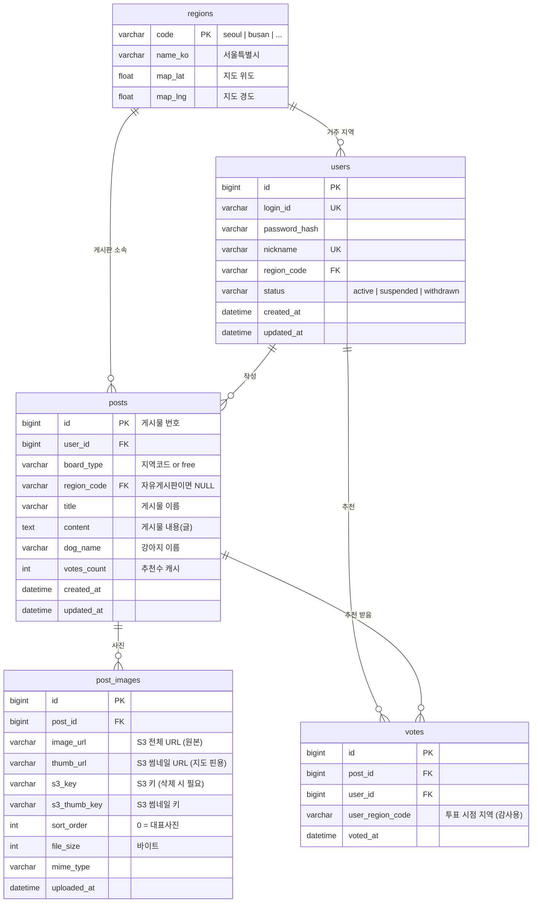

# 귀여운 강아지 투표 게시판 — 사진 저장 완전 가이드

> 게시판 사진 업로드 · DB 저장 · S3 연동 · 삭제 · 지도 핀 표시까지 전체 흐름

---

## 목차

1. [저장 방식 선택](#1-저장-방식-선택)
2. [전체 흐름도](#2-전체-흐름도)
3. [데이터베이스 구조](#3-데이터베이스-구조)
4. [Linux 환경 셋업](#4-linux-환경-셋업)
5. [S3 버킷 설정](#5-s3-버킷-설정)
6. [백엔드 구현 (Node.js)](#6-백엔드-구현-nodejs)
7. [프론트엔드 구현](#7-프론트엔드-구현)
8. [사진 조회 · 삭제](#8-사진-조회--삭제)
9. [지도 핀 TOP 10 조회](#9-지도-핀-top-10-조회)
10. [운영 체크리스트](#10-운영-체크리스트)

---

## 1. 저장 방식 선택

| 방식 | 설명 | 장점 | 단점 | 추천 |
|------|------|------|------|------|
| **DB BLOB 직접 저장** | 이미지 바이너리를 DB에 저장 | 구조 단순 | DB 용량 폭발, 조회 느림 | ❌ |
| **서버 로컬 저장** | 서버 디스크에 파일 저장, DB엔 경로만 | 구축 쉬움 | 서버 장애 시 사진 유실, 이중화 불가 | △ 소규모 |
| **S3 오브젝트 스토리지** | 파일은 S3, DB엔 URL만 저장 | 확장성, 내구성 99.999%, CDN 연동 | 초기 설정 필요 | ✅ 권장 |

> **결론: 파일은 S3에 저장하고, DB `post_images` 테이블에 URL과 S3 키만 기록합니다.**

---

## 2. 전체 흐름도

```
[사용자 브라우저]
      │
      │ ① 강아지 사진 선택 + 게시물 작성
      ▼
[프론트엔드]
      │
      │ ② multipart/form-data 로 POST /api/posts 요청
      │    (title, content, dog_name, board_type, images[])
      ▼
[백엔드 서버 (Node.js / Express)]
      │
      ├─ ③ 파일 유효성 검사
      │       확장자: jpg, jpeg, png, webp, gif
      │       MIME:   image/jpeg, image/png, image/webp, image/gif
      │       용량:   파일 1개 최대 10MB
      │       개수:   게시물당 최대 5장
      │
      ├─ ④ sharp로 썸네일 생성 (지도 핀용 300x300)
      │
      ├─ ⑤ S3에 원본 + 썸네일 업로드
      │       원본:     dogs/{yyyy}/{mm}/{post_id}/original/{uuid}.webp
      │       썸네일:   dogs/{yyyy}/{mm}/{post_id}/thumb/{uuid}_thumb.webp
      │       반환:     https://cdn.example.com/dogs/.../photo.webp
      │
      ├─ ⑥ MySQL posts 테이블에 게시물 INSERT
      │
      └─ ⑦ MySQL post_images 테이블에 URL + S3 키 INSERT
              (post_id, image_url, s3_key, sort_order)

[조회 시]
      └─ post_images.image_url → 브라우저가 S3/CDN에서 직접 로드
         post_images.sort_order = 0 → 지도 핀 대표 사진
```

---

## 3. 데이터베이스 구조

### 테이블 목록

| # | 테이블 | 설명 |
|---|--------|------|
| 1 | `regions` | 지역 마스터 (17개 도·시 + 지도 좌표) |
| 2 | `users` | 회원 (거주 지역 포함) |
| 3 | `posts` | 게시물 (게시물 번호, 이름, 내용, 추천수 등) |
| 4 | `post_images` | 게시물 사진 (S3 URL + 키 저장) |
| 5 | `votes` | 추천 (지역 제한 + 중복 방지) |

### ERD



### DDL (MySQL 8.0+)

```sql
SET FOREIGN_KEY_CHECKS = 0;

-- ── 1. regions ────────────────────────────────────────────
CREATE TABLE IF NOT EXISTS regions (
    code     VARCHAR(20)  PRIMARY KEY,
    name_ko  VARCHAR(50)  NOT NULL,
    map_lat  FLOAT        NOT NULL,
    map_lng  FLOAT        NOT NULL
) ENGINE=InnoDB DEFAULT CHARSET=utf8mb4 COLLATE=utf8mb4_unicode_ci;

INSERT IGNORE INTO regions VALUES
('seoul',    '서울특별시',     37.5665, 126.9780),
('busan',    '부산광역시',     35.1796, 129.0756),
('daegu',    '대구광역시',     35.8714, 128.6014),
('incheon',  '인천광역시',     37.4563, 126.7052),
('gwangju',  '광주광역시',     35.1595, 126.8526),
('daejeon',  '대전광역시',     36.3504, 127.3845),
('ulsan',    '울산광역시',     35.5384, 129.3114),
('sejong',   '세종특별자치시', 36.4800, 127.2890),
('gyeonggi', '경기도',         37.4138, 127.5183),
('gangwon',  '강원특별자치도', 37.8228, 128.1555),
('chungbuk', '충청북도',       36.8000, 127.7000),
('chungnam', '충청남도',       36.5184, 126.8000),
('jeonbuk',  '전북특별자치도', 35.7175, 127.1530),
('jeonnam',  '전라남도',       34.8679, 126.9910),
('gyeongbuk','경상북도',       36.4919, 128.8889),
('gyeongnam','경상남도',       35.4606, 128.2132),
('jeju',     '제주특별자치도', 33.4996, 126.5312);

-- ── 2. users ──────────────────────────────────────────────
CREATE TABLE IF NOT EXISTS users (
    id            BIGINT AUTO_INCREMENT PRIMARY KEY,
    login_id      VARCHAR(100) NOT NULL UNIQUE,
    password_hash VARCHAR(255) NOT NULL,
    nickname      VARCHAR(50)  NOT NULL UNIQUE,
    region_code   VARCHAR(20)  NOT NULL,
    status        VARCHAR(20)  NOT NULL DEFAULT 'active'
                  CHECK (status IN ('active','suspended','withdrawn')),
    created_at    DATETIME     NOT NULL DEFAULT CURRENT_TIMESTAMP,
    updated_at    DATETIME     NOT NULL DEFAULT CURRENT_TIMESTAMP ON UPDATE CURRENT_TIMESTAMP,
    CONSTRAINT fk_users_region FOREIGN KEY (region_code) REFERENCES regions(code)
) ENGINE=InnoDB DEFAULT CHARSET=utf8mb4 COLLATE=utf8mb4_unicode_ci;

CREATE INDEX idx_users_region ON users(region_code);

-- ── 3. posts ──────────────────────────────────────────────
CREATE TABLE IF NOT EXISTS posts (
    id           BIGINT AUTO_INCREMENT PRIMARY KEY,
    user_id      BIGINT       NOT NULL,
    board_type   VARCHAR(20)  NOT NULL,         -- 지역코드 or 'free'
    region_code  VARCHAR(20)  NULL,             -- 자유게시판이면 NULL
    title        VARCHAR(200) NOT NULL,         -- 게시물 이름
    content      TEXT         NOT NULL,         -- 게시물 내용 (글)
    dog_name     VARCHAR(100),
    votes_count  INT          NOT NULL DEFAULT 0,
    created_at   DATETIME     NOT NULL DEFAULT CURRENT_TIMESTAMP,
    updated_at   DATETIME     NOT NULL DEFAULT CURRENT_TIMESTAMP ON UPDATE CURRENT_TIMESTAMP,
    CONSTRAINT fk_posts_user   FOREIGN KEY (user_id)     REFERENCES users(id),
    CONSTRAINT fk_posts_region FOREIGN KEY (region_code) REFERENCES regions(code)
) ENGINE=InnoDB DEFAULT CHARSET=utf8mb4 COLLATE=utf8mb4_unicode_ci;

CREATE INDEX idx_posts_board_type    ON posts(board_type);
CREATE INDEX idx_posts_region_votes  ON posts(region_code, votes_count DESC);
CREATE INDEX idx_posts_created_at    ON posts(created_at DESC);

-- ── 4. post_images ────────────────────────────────────────
CREATE TABLE IF NOT EXISTS post_images (
    id           BIGINT AUTO_INCREMENT PRIMARY KEY,
    post_id      BIGINT       NOT NULL,
    image_url    VARCHAR(500) NOT NULL,   -- S3 원본 URL
    thumb_url    VARCHAR(500),            -- S3 썸네일 URL (지도 핀용 300x300)
    s3_key       VARCHAR(500) NOT NULL,   -- S3 원본 키 (삭제 시 필요)
    s3_thumb_key VARCHAR(500),            -- S3 썸네일 키
    sort_order   INT          NOT NULL DEFAULT 0,  -- 0 = 대표사진
    file_size    INT,                     -- 바이트
    mime_type    VARCHAR(50),             -- image/webp 등
    uploaded_at  DATETIME     NOT NULL DEFAULT CURRENT_TIMESTAMP,
    CONSTRAINT fk_images_post
        FOREIGN KEY (post_id) REFERENCES posts(id) ON DELETE CASCADE
) ENGINE=InnoDB DEFAULT CHARSET=utf8mb4 COLLATE=utf8mb4_unicode_ci;

CREATE INDEX idx_post_images_post ON post_images(post_id, sort_order);

-- ── 5. votes ──────────────────────────────────────────────
CREATE TABLE IF NOT EXISTS votes (
    id               BIGINT AUTO_INCREMENT PRIMARY KEY,
    post_id          BIGINT      NOT NULL,
    user_id          BIGINT      NOT NULL,
    user_region_code VARCHAR(20) NOT NULL,   -- 투표 시점 지역 기록 (감사용)
    voted_at         DATETIME    NOT NULL DEFAULT CURRENT_TIMESTAMP,
    UNIQUE KEY uq_vote (post_id, user_id),  -- 게시물당 1회만 투표 가능
    CONSTRAINT fk_votes_post FOREIGN KEY (post_id) REFERENCES posts(id) ON DELETE CASCADE,
    CONSTRAINT fk_votes_user FOREIGN KEY (user_id) REFERENCES users(id)
) ENGINE=InnoDB DEFAULT CHARSET=utf8mb4 COLLATE=utf8mb4_unicode_ci;

CREATE INDEX idx_votes_post_id ON votes(post_id);
CREATE INDEX idx_votes_user_id ON votes(user_id);

SET FOREIGN_KEY_CHECKS = 1;
```

---

## 4. Linux 환경 셋업

### 4-1. MySQL 설치 (Ubuntu 기준)

```bash
# 패키지 업데이트
sudo apt-get update

# MySQL 8.0 설치
sudo apt-get install -y mysql-server

# 서비스 시작 + 부팅 자동 시작
sudo systemctl start mysql
sudo systemctl enable mysql

# 보안 설정
sudo mysql_secure_installation
```

### 4-2. DB + 사용자 생성

```bash
sudo mysql -u root -p
```

```sql
CREATE DATABASE dogvote
    CHARACTER SET utf8mb4
    COLLATE utf8mb4_unicode_ci;

CREATE USER 'dogvote_user'@'localhost' IDENTIFIED BY '비밀번호입력';
GRANT ALL PRIVILEGES ON dogvote.* TO 'dogvote_user'@'localhost';
FLUSH PRIVILEGES;
EXIT;
```

### 4-3. 스키마 적용

```bash
mysql -u dogvote_user -p dogvote < dogvote_schema.sql

# 테이블 확인
mysql -u dogvote_user -p dogvote -e "SHOW TABLES;"
```

### 4-4. Node.js + 필수 패키지 설치

```bash
# Node.js 20 LTS 설치
curl -fsSL https://deb.nodesource.com/setup_20.x | sudo -E bash -
sudo apt-get install -y nodejs

# 프로젝트 초기화
mkdir dogvote-api && cd dogvote-api
npm init -y

# 필수 패키지 설치
npm install express multer multer-s3 @aws-sdk/client-s3 sharp mysql2 dotenv
```

### 4-5. 환경 변수 파일 (.env)

```bash
# .env 파일 생성
cat > .env << 'EOF'
# 서버
PORT=3000

# MySQL
DB_HOST=localhost
DB_PORT=3306
DB_NAME=dogvote
DB_USER=dogvote_user
DB_PASS=비밀번호입력

# AWS S3
AWS_REGION=ap-northeast-2
AWS_ACCESS_KEY_ID=여기에_입력
AWS_SECRET_ACCESS_KEY=여기에_입력
S3_BUCKET_NAME=my-dog-bucket
CDN_BASE_URL=https://cdn.example.com   # CloudFront 사용 시
EOF
```

---

## 5. S3 버킷 설정

### 5-1. 버킷 생성 (AWS CLI)

```bash
# AWS CLI 설치
sudo apt-get install -y awscli
aws configure   # Access Key, Secret Key, Region 입력

# 버킷 생성 (서울 리전)
aws s3api create-bucket \
    --bucket my-dog-bucket \
    --region ap-northeast-2 \
    --create-bucket-configuration LocationConstraint=ap-northeast-2

# 퍼블릭 액세스 허용 (사진 공개 읽기 시)
aws s3api put-public-access-block \
    --bucket my-dog-bucket \
    --public-access-block-configuration \
    "BlockPublicAcls=false,IgnorePublicAcls=false,BlockPublicPolicy=false,RestrictPublicBuckets=false"
```

### 5-2. 버킷 정책 (공개 읽기)

```json
{
    "Version": "2012-10-17",
    "Statement": [
        {
            "Sid": "PublicReadGetObject",
            "Effect": "Allow",
            "Principal": "*",
            "Action": "s3:GetObject",
            "Resource": "arn:aws:s3:::my-dog-bucket/*"
        }
    ]
}
```

```bash
aws s3api put-bucket-policy \
    --bucket my-dog-bucket \
    --policy file://bucket-policy.json
```

### 5-3. S3 디렉토리 구조

```
my-dog-bucket/
└── dogs/
    └── {YYYY}/
        └── {MM}/
            └── {post_id}/
                ├── original/
                │   └── {uuid}.webp        ← 원본 (최대 10MB)
                └── thumb/
                    └── {uuid}_thumb.webp  ← 썸네일 300x300 (지도 핀용)
```

---

## 6. 백엔드 구현 (Node.js)

### 6-1. DB 연결 (config/db.js)

```javascript
const mysql = require('mysql2/promise');
require('dotenv').config();

const pool = mysql.createPool({
    host:     process.env.DB_HOST,
    port:     process.env.DB_PORT,
    database: process.env.DB_NAME,
    user:     process.env.DB_USER,
    password: process.env.DB_PASS,
    waitForConnections: true,
    connectionLimit:    10,
    charset: 'utf8mb4',
});

module.exports = pool;
```

### 6-2. S3 클라이언트 (config/s3.js)

```javascript
const { S3Client } = require('@aws-sdk/client-s3');
require('dotenv').config();

const s3 = new S3Client({
    region: process.env.AWS_REGION,
    credentials: {
        accessKeyId:     process.env.AWS_ACCESS_KEY_ID,
        secretAccessKey: process.env.AWS_SECRET_ACCESS_KEY,
    },
});

module.exports = s3;
```

### 6-3. 업로드 미들웨어 (middleware/upload.js)

```javascript
const multer   = require('multer');
const multerS3 = require('multer-s3');
const path     = require('path');
const { v4: uuidv4 } = require('uuid');
const s3       = require('../config/s3');
require('dotenv').config();

const ALLOWED_MIME = ['image/jpeg', 'image/png', 'image/webp', 'image/gif'];
const MAX_SIZE     = 10 * 1024 * 1024;  // 10MB
const MAX_COUNT    = 5;

const upload = multer({
    storage: multerS3({
        s3,
        bucket: process.env.S3_BUCKET_NAME,
        contentType: multerS3.AUTO_CONTENT_TYPE,
        key: (req, file, cb) => {
            const now    = new Date();
            const yyyy   = now.getFullYear();
            const mm     = String(now.getMonth() + 1).padStart(2, '0');
            const postId = req.params.postId || 'temp';
            const uuid   = uuidv4();
            const ext    = path.extname(file.originalname).toLowerCase() || '.jpg';
            // S3 키: dogs/2025/05/1042/original/uuid.jpg
            const key = `dogs/${yyyy}/${mm}/${postId}/original/${uuid}${ext}`;
            cb(null, key);
        },
    }),
    fileFilter: (req, file, cb) => {
        if (ALLOWED_MIME.includes(file.mimetype)) {
            cb(null, true);
        } else {
            cb(new Error('허용되지 않는 파일 형식입니다. (jpg, png, webp, gif만 가능)'));
        }
    },
    limits: {
        fileSize: MAX_SIZE,
        files:    MAX_COUNT,
    },
});

module.exports = upload;
```

### 6-4. 게시물 + 사진 등록 API (routes/posts.js)

```javascript
const express  = require('express');
const router   = express.Router();
const sharp    = require('sharp');
const { PutObjectCommand, DeleteObjectCommand } = require('@aws-sdk/client-s3');
const s3       = require('../config/s3');
const db       = require('../config/db');
const upload   = require('../middleware/upload');
require('dotenv').config();

const BUCKET = process.env.S3_BUCKET_NAME;
const CDN    = process.env.CDN_BASE_URL || `https://${BUCKET}.s3.amazonaws.com`;

// ── 썸네일 생성 후 S3 업로드 ────────────────────────────
async function uploadThumb(originalKey, fileBuffer) {
    const thumbKey = originalKey.replace('/original/', '/thumb/')
                                .replace(/(\.[^.]+)$/, '_thumb$1');

    const thumbBuffer = await sharp(fileBuffer)
        .resize(300, 300, { fit: 'cover' })
        .webp({ quality: 80 })
        .toBuffer();

    await s3.send(new PutObjectCommand({
        Bucket:      BUCKET,
        Key:         thumbKey,
        Body:        thumbBuffer,
        ContentType: 'image/webp',
    }));

    return thumbKey;
}

// ── POST /api/posts — 게시물 + 사진 등록 ────────────────
router.post('/', upload.array('images', 5), async (req, res) => {
    const conn = await db.getConnection();
    try {
        await conn.beginTransaction();

        const { title, content, dog_name, board_type, region_code } = req.body;
        const userId = req.user.id;          // 인증 미들웨어에서 주입

        // ① 지역 게시판이면 사용자 지역 == 게시판 지역 확인
        if (board_type !== 'free' && req.user.region_code !== board_type) {
            return res.status(403).json({ message: '본인 지역 게시판에만 글을 작성할 수 있습니다.' });
        }

        // ② posts INSERT
        const [postResult] = await conn.execute(
            `INSERT INTO posts (user_id, board_type, region_code, title, content, dog_name)
             VALUES (?, ?, ?, ?, ?, ?)`,
            [userId, board_type, region_code || null, title, content, dog_name || null]
        );
        const postId = postResult.insertId;

        // ③ 사진 처리
        if (req.files && req.files.length > 0) {
            for (let i = 0; i < req.files.length; i++) {
                const file      = req.files[i];
                const s3Key     = file.key;                          // multer-s3가 설정한 키
                const imageUrl  = `${CDN}/${s3Key}`;

                // ④ 썸네일 생성 + S3 업로드
                const s3ThumbKey = await uploadThumb(s3Key, file.buffer);
                const thumbUrl   = `${CDN}/${s3ThumbKey}`;

                // ⑤ post_images INSERT
                await conn.execute(
                    `INSERT INTO post_images
                        (post_id, image_url, thumb_url, s3_key, s3_thumb_key, sort_order, file_size, mime_type)
                     VALUES (?, ?, ?, ?, ?, ?, ?, ?)`,
                    [postId, imageUrl, thumbUrl, s3Key, s3ThumbKey, i, file.size, file.mimetype]
                );
            }
        }

        await conn.commit();
        res.status(201).json({ message: '게시물이 등록되었습니다.', post_id: postId });

    } catch (err) {
        await conn.rollback();
        console.error(err);
        res.status(500).json({ message: '게시물 등록에 실패했습니다.' });
    } finally {
        conn.release();
    }
});

module.exports = router;
```

### 6-5. 투표 API (지역 제한 포함)

```javascript
// POST /api/posts/:postId/vote
router.post('/:postId/vote', async (req, res) => {
    const conn = await db.getConnection();
    try {
        await conn.beginTransaction();

        const postId         = req.params.postId;
        const userId         = req.user.id;
        const userRegion     = req.user.region_code;

        // ① 게시물 지역 조회
        const [[post]] = await conn.execute(
            'SELECT region_code, board_type FROM posts WHERE id = ?', [postId]
        );
        if (!post) return res.status(404).json({ message: '게시물이 없습니다.' });

        // ② 지역 투표 제한 (자유게시판은 제한 없음)
        if (post.board_type !== 'free' && post.region_code !== userRegion) {
            return res.status(403).json({ message: '본인 지역 게시물에만 투표할 수 있습니다.' });
        }

        // ③ 중복 투표 방지 (DB UNIQUE KEY가 막아줌, INSERT IGNORE 활용)
        const [result] = await conn.execute(
            `INSERT IGNORE INTO votes (post_id, user_id, user_region_code)
             VALUES (?, ?, ?)`,
            [postId, userId, userRegion]
        );

        if (result.affectedRows === 0) {
            return res.status(409).json({ message: '이미 투표한 게시물입니다.' });
        }

        // ④ votes_count 캐시 업데이트
        await conn.execute(
            'UPDATE posts SET votes_count = votes_count + 1 WHERE id = ?', [postId]
        );

        await conn.commit();
        res.json({ message: '투표가 완료되었습니다.' });

    } catch (err) {
        await conn.rollback();
        res.status(500).json({ message: '투표에 실패했습니다.' });
    } finally {
        conn.release();
    }
});
```

---

## 7. 프론트엔드 구현

### 7-1. 사진 업로드 폼 (HTML)

```html
<form id="postForm" enctype="multipart/form-data">
    <input type="text"  name="title"      placeholder="게시물 제목" required>
    <input type="text"  name="dog_name"   placeholder="강아지 이름">
    <textarea           name="content"    placeholder="내용을 입력하세요" required></textarea>
    <input type="hidden" name="board_type" value="seoul">

    <!-- 사진 업로드: 최대 5장 -->
    <input type="file" name="images" accept="image/*" multiple>
    <small>최대 5장, 파일당 10MB 이하, jpg / png / webp / gif</small>

    <!-- 미리보기 영역 -->
    <div id="preview"></div>

    <button type="submit">게시물 등록</button>
</form>
```

### 7-2. 사진 미리보기 + 업로드 (JavaScript)

```javascript
// 사진 선택 시 미리보기
document.querySelector('input[name="images"]').addEventListener('change', (e) => {
    const preview = document.getElementById('preview');
    preview.innerHTML = '';

    const files = Array.from(e.target.files);

    // 개수 제한
    if (files.length > 5) {
        alert('사진은 최대 5장까지 업로드할 수 있습니다.');
        e.target.value = '';
        return;
    }

    files.forEach((file, idx) => {
        // 용량 제한
        if (file.size > 10 * 1024 * 1024) {
            alert(`${file.name} 파일이 10MB를 초과합니다.`);
            return;
        }

        const reader = new FileReader();
        reader.onload = (ev) => {
            const img = document.createElement('img');
            img.src   = ev.target.result;
            img.style = 'width:100px; height:100px; object-fit:cover; margin:4px;';
            if (idx === 0) img.title = '대표 사진';
            preview.appendChild(img);
        };
        reader.readAsDataURL(file);
    });
});

// 폼 제출
document.getElementById('postForm').addEventListener('submit', async (e) => {
    e.preventDefault();

    const formData = new FormData(e.target);

    const res = await fetch('/api/posts', {
        method:  'POST',
        headers: { Authorization: `Bearer ${localStorage.getItem('token')}` },
        body:    formData,   // Content-Type은 자동으로 multipart/form-data 설정됨
    });

    const data = await res.json();
    if (res.ok) {
        alert('게시물이 등록되었습니다!');
        location.href = `/posts/${data.post_id}`;
    } else {
        alert(data.message);
    }
});
```

---

## 8. 사진 조회 · 삭제

### 8-1. 게시물 + 사진 조회

```sql
-- 게시물 상세 + 모든 사진 조회
SELECT
    p.id           AS post_id,
    p.title,
    p.content,
    p.dog_name,
    p.votes_count,
    p.created_at,
    u.nickname     AS author,
    pi.id          AS image_id,
    pi.image_url,
    pi.thumb_url,
    pi.sort_order
FROM posts p
JOIN users u ON p.user_id = u.id
LEFT JOIN post_images pi ON pi.post_id = p.id
WHERE p.id = :post_id
ORDER BY pi.sort_order ASC;
```

### 8-2. 게시물 삭제 (S3 파일 + DB 동시 삭제)

```javascript
// DELETE /api/posts/:postId
router.delete('/:postId', async (req, res) => {
    const conn = await db.getConnection();
    try {
        await conn.beginTransaction();

        const postId = req.params.postId;

        // ① S3 키 목록 조회
        const [images] = await conn.execute(
            'SELECT s3_key, s3_thumb_key FROM post_images WHERE post_id = ?', [postId]
        );

        // ② S3 파일 삭제
        for (const img of images) {
            if (img.s3_key) {
                await s3.send(new DeleteObjectCommand({ Bucket: BUCKET, Key: img.s3_key }));
            }
            if (img.s3_thumb_key) {
                await s3.send(new DeleteObjectCommand({ Bucket: BUCKET, Key: img.s3_thumb_key }));
            }
        }

        // ③ DB 삭제 (ON DELETE CASCADE로 post_images, votes도 자동 삭제)
        await conn.execute('DELETE FROM posts WHERE id = ?', [postId]);

        await conn.commit();
        res.json({ message: '게시물이 삭제되었습니다.' });

    } catch (err) {
        await conn.rollback();
        res.status(500).json({ message: '삭제에 실패했습니다.' });
    } finally {
        conn.release();
    }
});
```

---

## 9. 지도 핀 TOP 10 조회

```sql
-- 특정 도의 추천수 TOP 10 (지도 핀 표시용)
SELECT
    p.id            AS post_id,
    p.title,
    p.dog_name,
    p.votes_count,
    r.name_ko       AS region_name,
    r.map_lat,
    r.map_lng,
    pi.thumb_url    AS pin_image     -- 지도 핀에 표시할 썸네일
FROM posts p
JOIN regions r      ON p.region_code = r.code
LEFT JOIN post_images pi
    ON pi.post_id = p.id
    AND pi.sort_order = 0           -- 대표 사진만
WHERE p.region_code = 'seoul'       -- 원하는 지역 코드로 교체
ORDER BY p.votes_count DESC
LIMIT 10;

-- 전국 모든 도의 TOP 1씩 한 번에 조회 (지도 전체 핀)
SELECT
    p.id, p.dog_name, p.votes_count,
    r.code, r.name_ko, r.map_lat, r.map_lng,
    pi.thumb_url AS pin_image
FROM posts p
JOIN regions r ON p.region_code = r.code
LEFT JOIN post_images pi ON pi.post_id = p.id AND pi.sort_order = 0
WHERE p.id IN (
    -- 각 지역별 votes_count 1위 게시물 ID
    SELECT id FROM (
        SELECT id, region_code,
               RANK() OVER (PARTITION BY region_code ORDER BY votes_count DESC) AS rnk
        FROM posts
        WHERE board_type != 'free'
    ) ranked
    WHERE rnk = 1
)
ORDER BY r.code;
```

---

## 10. 운영 체크리스트

| 항목 | 내용 | 완료 |
|------|------|------|
| DB 비밀번호 변경 | 기본값 사용 금지 | ☐ |
| .env 파일 보안 | .gitignore에 추가 필수 | ☐ |
| S3 IAM 권한 최소화 | PutObject, GetObject, DeleteObject만 허용 | ☐ |
| 이미지 MIME 검사 | 확장자뿐 아니라 실제 MIME 타입 검증 | ☐ |
| 파일 용량 제한 | 서버(multer) + nginx 양쪽 설정 | ☐ |
| S3 수명 주기 설정 | /temp/ 폴더 7일 후 자동 삭제 | ☐ |
| CloudFront 연동 | S3 직접 접근 대신 CDN URL 사용 | ☐ |
| 게시물 삭제 시 S3도 삭제 | 고아 파일 방지 | ☐ |
| 지역 투표 제한 검증 | 앱 레벨에서 region_code 비교 | ☐ |
| 중복 투표 방지 | DB UNIQUE KEY (post_id, user_id) | ☐ |

---

## 파일 유효성 검사 규칙 요약

```
허용 확장자 : jpg, jpeg, png, webp, gif
허용 MIME   : image/jpeg, image/png, image/webp, image/gif
최대 용량   : 파일 1개당 10MB
최대 개수   : 게시물당 최대 5장
썸네일 크기 : 300 x 300 px (cover 방식, 지도 핀용)
저장 형식   : 썸네일은 WebP로 변환 (용량 절감)
```
